# AI Car Wash

An AI-receptionist booking system for a Malaysian neighborhood car wash. Customers book a wash by chatting with **Timah**, an AI receptionist, over WebSocket — no app download, no forms, just a conversation. Staff (Owner, Clerks, Workers) run the shop from role-specific dashboards.

**Stack:** React 19 + TypeScript + Vite + Tailwind (frontend) · Spring Boot 3.4 + Java 21 + PostgreSQL + Redis (backend) · Google Gemini (Timah) · ToyyibPay (FPX payments)

**Live demo:** [aicarwash.theahmadiqbal24.workers.dev](https://aicarwash.theahmadiqbal24.workers.dev/)

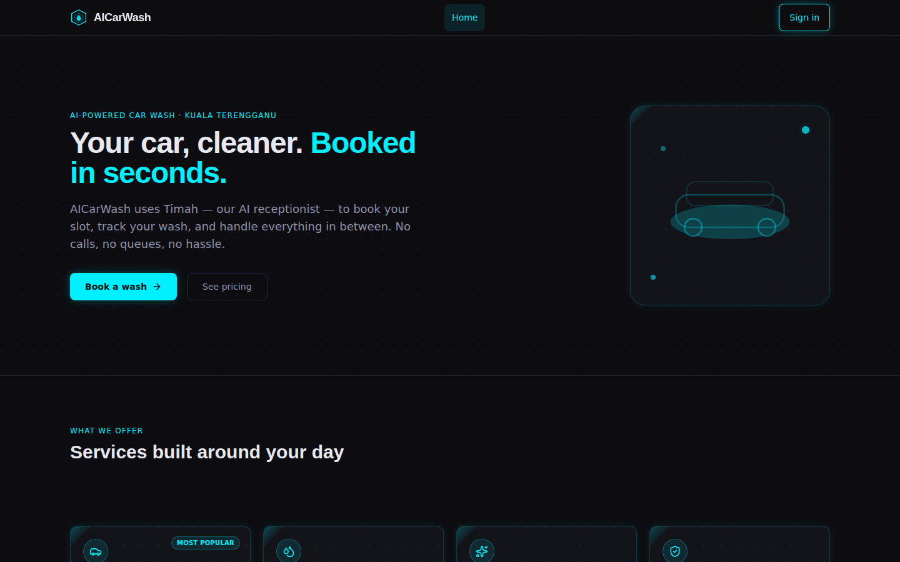

---

## Table of Contents

- [Features](#features)
- [Tech Stack](#tech-stack)
- [Project Structure](#project-structure)
- [Getting Started](#getting-started)
- [User Guide](#user-guide)
  - [Roles](#roles)
  - [Signing Up & Logging In](#signing-up--logging-in)
  - [Pages](#pages)
- [Business Rules](#business-rules)
- [Deployment](#deployment)
- [Testing](#testing)

---

## Features

- Conversational booking with an AI receptionist ("Timah") over WebSocket
- 3-step guided booking flow (slot → service → confirm) as an alternative to chat
- Valet pick-up / return-delivery add-ons with geolocation support
- Cash-at-counter or online FPX payment via ToyyibPay
- Live status updates pushed to customers and staff over WebSocket
- Role-based dashboards for Owner (analytics, user directory), Clerk (console, valet requests), and Worker (job board)
- Owner analytics with AI-generated insights, revenue trends, and payment-method breakdown

## Tech Stack

| Layer | Technology |
|---|---|
| Frontend | React 19, TypeScript, Vite, Tailwind CSS, React Router 7 |
| Backend | Spring Boot 3.4, Java 21, Spring Security, Spring WebFlux/WebSocket |
| Database | PostgreSQL 15 (Flyway migrations) |
| Cache / Rate limiting | Redis 7 |
| AI | Google Gemini (Timah chat + analytics insights) |
| Payments | ToyyibPay (FPX, Malaysian payment gateway) |
| Auth | JWT |
| Hosting | Spring Boot backend on Render, React frontend on Cloudflare Pages |
| E2E tests | Playwright |

## Project Structure

```
AI-Car-Wash/
├── car-wash-frontend/        # React + Vite SPA
│   └── src/
│       ├── pages/            # Route-level pages (see User Guide below)
│       ├── components/       # Layout, Login, ProtectedRoute, DataTable
│       ├── context/          # AuthContext (JWT, role, session)
│       └── api/               # API client
├── car-wash-backend/         # Spring Boot API
│   └── src/main/java/com/carwash/backend/
│       ├── controller/        # Auth, Booking, Valet, Timah chat, Analytics, ...
│       ├── service/, entity/, repository/, dto/, config/
│       └── resources/db/migration/  # Flyway SQL migrations
├── tests/                    # Playwright end-to-end tests
├── docker-compose.yml        # Local Postgres + Redis + backend + frontend
├── DEPLOY.md                 # Full deployment guide (Render + Cloudflare Pages)
└── docs/                     # Requirements & handoff notes
```

## Getting Started

### Prerequisites

- Node.js 20+
- Java 21 + Maven
- Docker & Docker Compose (for local Postgres/Redis)

### 1. Configure environment

```bash
cp .env.example .env
```

Fill in `.env` — at minimum `JWT_SECRET` (`openssl rand -base64 48`), `DB_USER`/`DB_PASSWORD`, and `GEMINI_API_KEY` (for Timah chat). ToyyibPay and SMTP variables are optional for local development; leaving `MAIL_HOST` empty disables email and leaves the app fully functional otherwise.

### 2. Run with Docker Compose (recommended)

```bash
docker compose up --build
```

This starts Postgres, Redis, the Spring Boot backend, and the frontend together. The frontend serves on **http://localhost:80**.

### 3. Or run frontend/backend separately

```bash
# Backend (needs Postgres + Redis running, e.g. via docker compose up postgres redis)
cd car-wash-backend
./mvnw spring-boot:run

# Frontend
cd car-wash-frontend
npm install
npm run dev   # http://localhost:5173
```

See [`DEPLOY.md`](DEPLOY.md) for production deployment to Render + Cloudflare Pages.

---

## User Guide

### Roles

The system has four roles, each with its own dashboard and permissions:

| Role | Who | Access |
|---|---|---|
| **CUSTOMER** | Anyone who signs up to book a wash | Book washes, chat with Timah, manage bookings, request valet pick-up, view own account |
| **CLERK** | Front-counter staff | Confirm payments, run the wash queue, manage valet requests |
| **WORKER** | Wash-bay staff | View and complete assigned wash jobs |
| **OWNER** | Shop owner/manager | Business analytics, staff/customer directory, transaction history |

### Signing Up & Logging In

- Go to `/login` (also reachable from the landing page's call-to-action buttons).
- **Sign up** is self-service for **customers only** — enter email, a Malaysian phone number (`+60…`), and a password. You're logged in immediately after registering.
- **Staff accounts** (Clerk, Worker, Owner) cannot self-register. An Owner creates them from the **User Directory** page, which issues a one-time temporary password for the new staff member to log in with.
- On **sign in**, you're routed straight to your role's home page: Owner → User Directory, Clerk → Console, Worker → Job board, Customer → Home.
- The navigation bar (top of every page) only shows the links relevant to your role, plus your role badge and a **Log out** button.

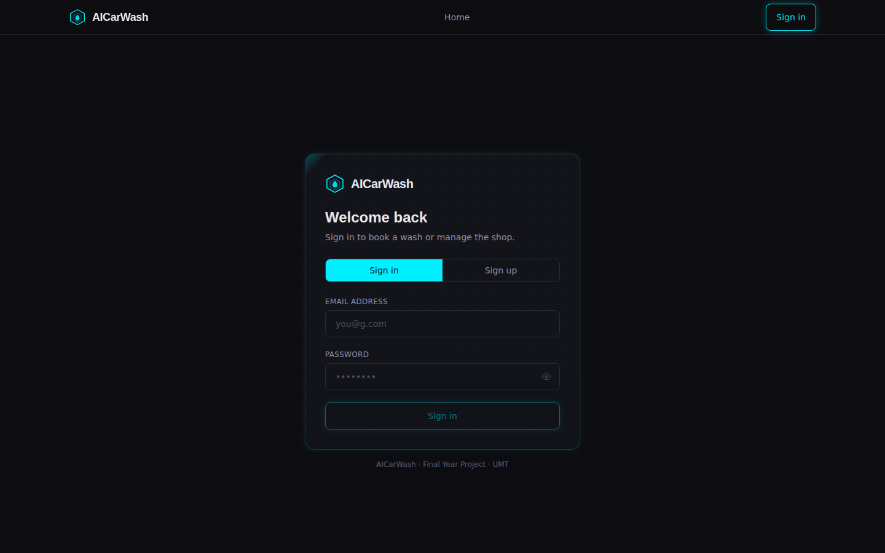

### Pages

#### Public

- **Landing (`/`)** — Marketing homepage shown to signed-out visitors: hero, service cards, pricing, an embedded map, and contact/hours. All call-to-action buttons lead to `/login`. Once logged in, `/` shows a simple "Ready for a wash?" dashboard instead, with shortcuts to booking and chat.

  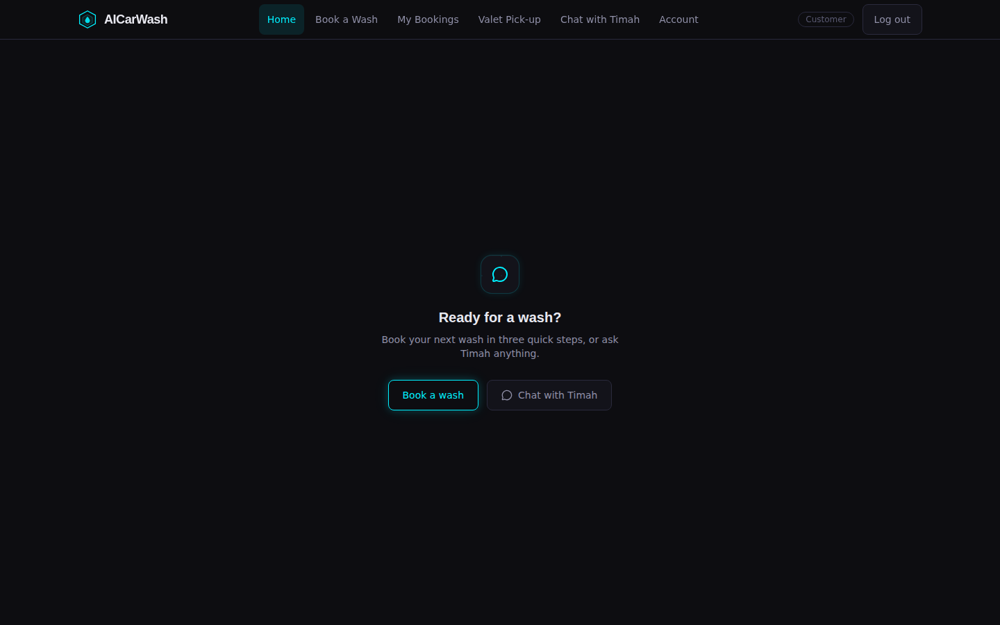

#### Customer

- **Book a Wash (`/book`)** — 3-step guided booking wizard:
  1. **Select Slot** — pick a date, an available time slot, vehicle class, and model.
  2. **Choose Service** — pick a wash package (price and duration shown).
  3. **Confirm** — optionally add valet pick-up/return-delivery (with fee and location pin), review the total, and submit. You're redirected to Checkout.

  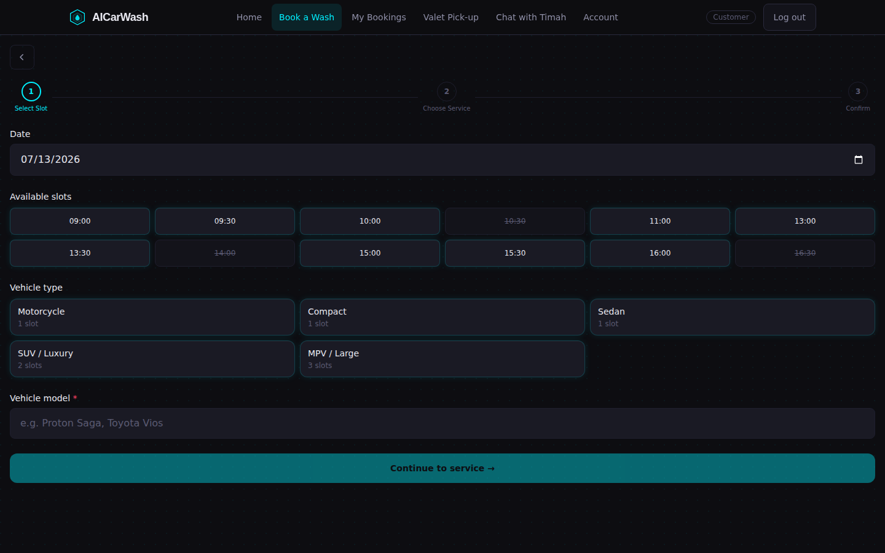

- **Chat with Timah (`/chat`)** — Real-time WebSocket chat with Timah, the AI receptionist, for booking a wash conversationally instead of using the wizard.

  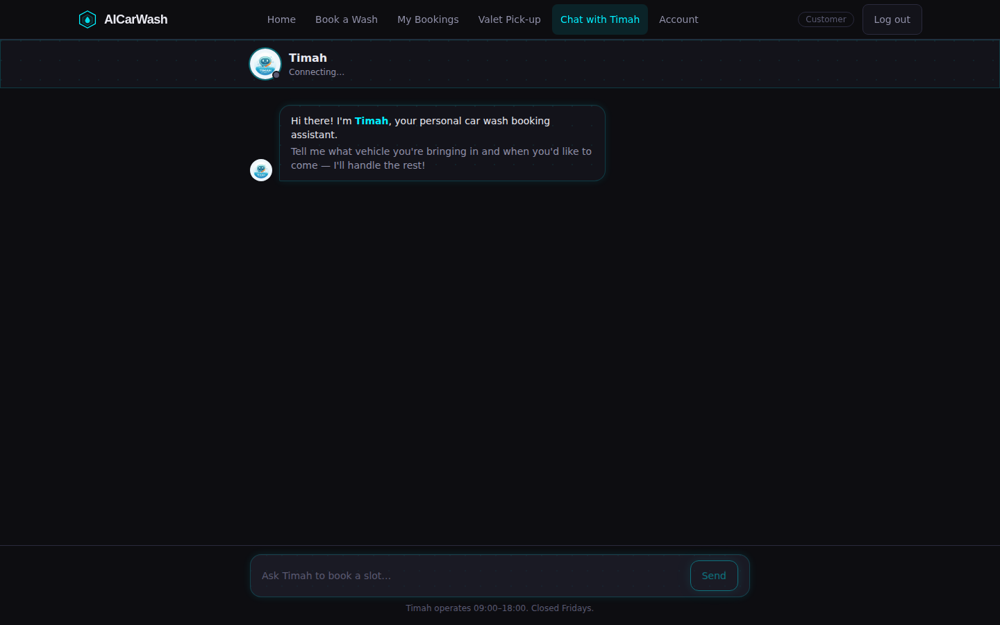

- **Checkout (`/checkout/:bookingId`)** — Shows the booking summary and total; pay by cash-at-counter or online via ToyyibPay (FPX). Displays a confirmation once paid, and lets you leave a star rating + review once the wash is completed.

  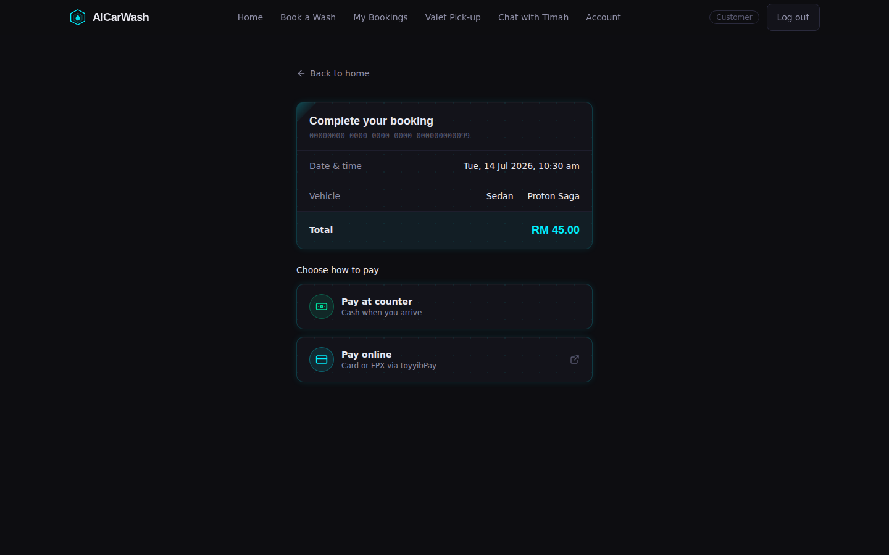

- **My Bookings (`/bookings`)** — Lists your bookings with live status badges (auto-updates over WebSocket). Pending bookings link to Pay Now; pending/confirmed bookings can be cancelled; completed bookings let you leave a review inline.

  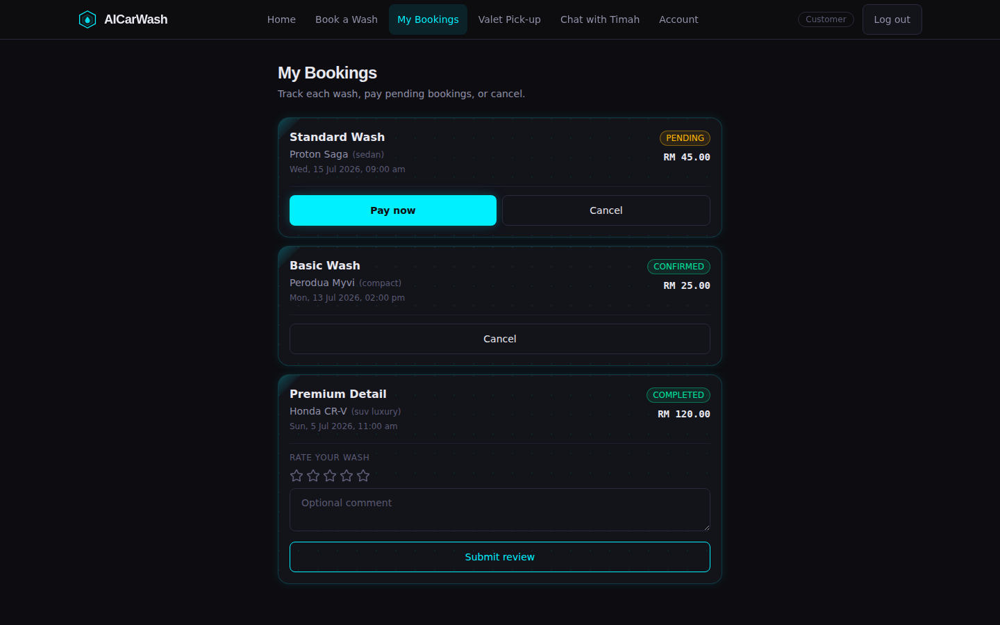

- **Valet Pick-up (`/valet`)** — Request a valet pick-up: choose branch, pickup time, vehicle class/model, and address (with a "use my location" helper). Also lists and lets you cancel your own valet requests.

  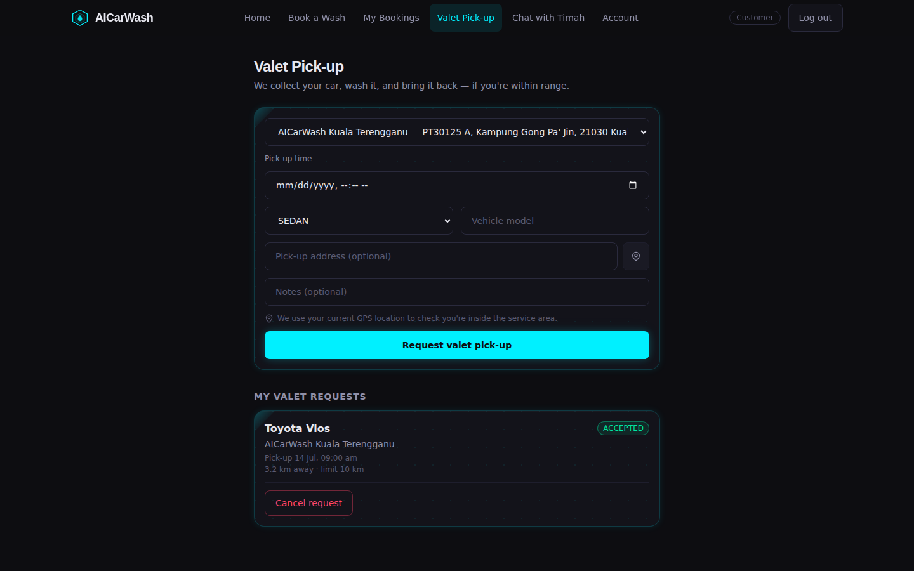

- **Account (`/account`)** — Update your phone number and password, and view your profile/join date. Customers get a link to their booking history.

  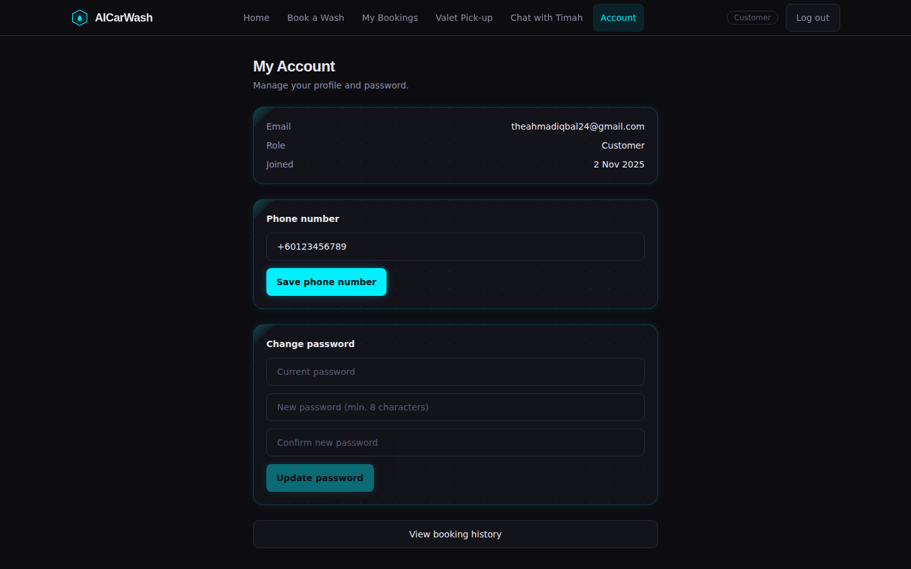

#### Clerk

- **Console (`/clerk`)** — The day's bookings needing attention, with actions to confirm cash payment, start a wash, mark it complete, or cancel — plus a form to create walk-in bookings by customer email, service, slot, and vehicle.

  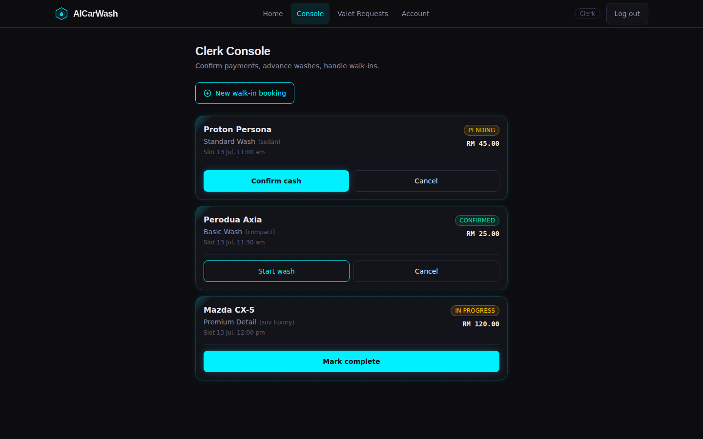

- **Valet Requests (`/clerk/valet`)** — Branch-scoped queue of customer valet requests with status-driven actions (Accept/Reject → Start pick-up/Cancel → Complete/Cancel), showing distance from branch and pickup address.

  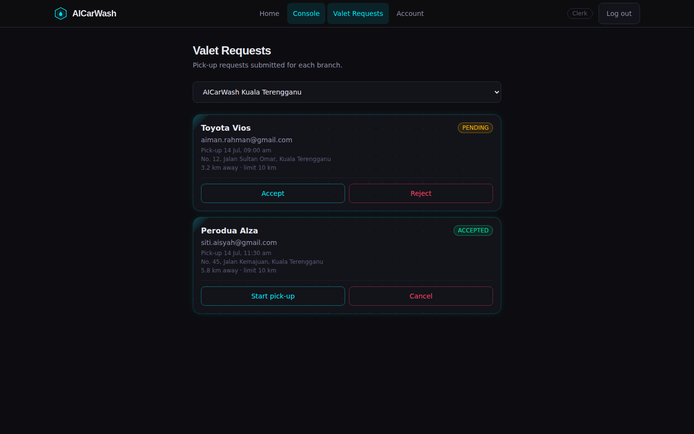

#### Worker

- **My Jobs (`/worker`)** — Job board of confirmed/in-progress washes assigned to you, with pickup/delivery add-on badges, address, and notes. Start a wash and mark it complete; completed jobs drop off the queue.

  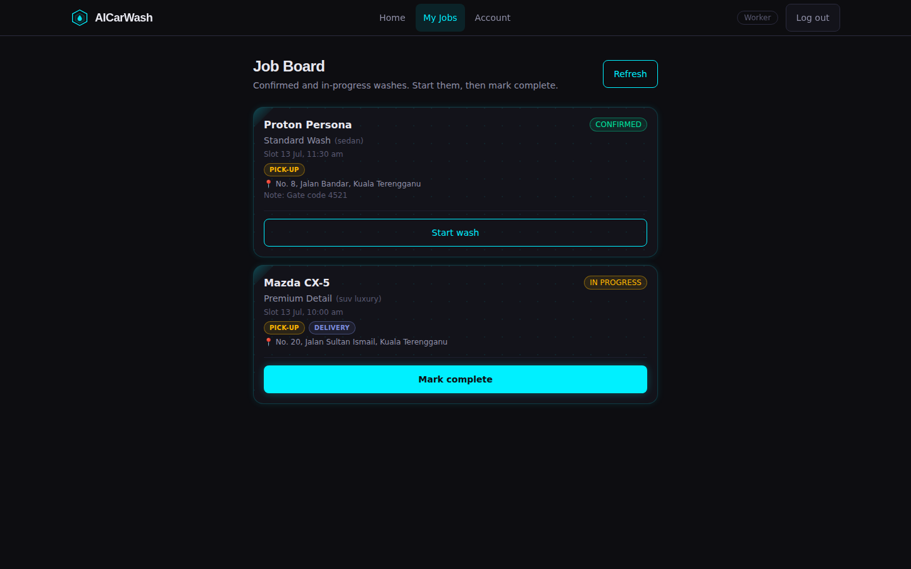

#### Owner

- **Analytics (`/admin/analytics`)** — AI-generated business insights (with public-holiday flags), daily KPI cards (revenue, bookings, cash vs online), a revenue trend chart (7/14/30-day toggle), booking status breakdown, and cash vs FPX payment split, with a date picker.

  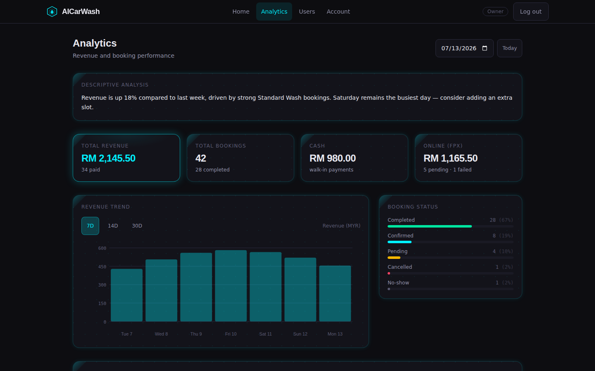

- **Users (`/admin/users`)** — Directory of customers and staff with search, role filter, and sorting. Create new staff accounts here (issues a one-time temp password); click a customer to view their transaction history.

  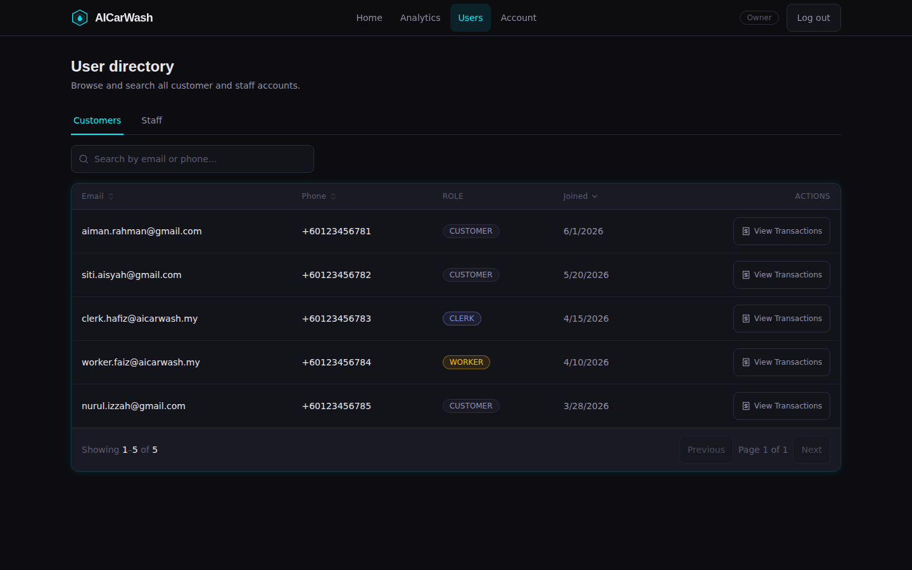

- **Transaction History (`/admin/users/:id/transactions`)** — A specific customer's paginated booking/payment history (slot time, vehicle, amount, payment status, transaction ID).

  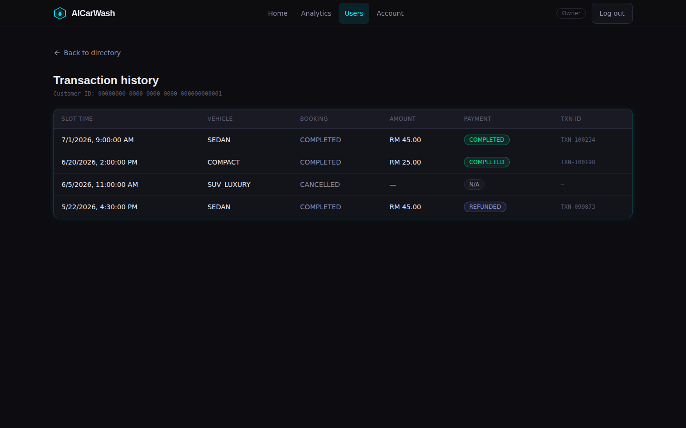

---

## Business Rules

- **Vehicle size pricing** — motorcycle (-RM 10), compact (-RM 5), sedan (baseline), SUV/luxury (+RM 15, +1 30-min block), MPV/large (+RM 25, +2 30-min blocks). Larger vehicles reserve contiguous time blocks.
- **No-show sweeper** — a background job runs every 5 minutes and marks bookings `no_show` if more than 15 minutes have passed since the scheduled slot, freeing the slot for walk-ins.
- **Rate limits** — Timah chat is limited to 20 messages / 5 minutes per user; login is limited to 5 attempts / 15 minutes per IP.

## Deployment

See [`DEPLOY.md`](DEPLOY.md) for the full guide: backend on Render (Postgres + Redis via `render.yaml`), frontend on Cloudflare Pages, plus the environment variables to wire up between them.

## Testing

- **Backend:** `cd car-wash-backend && ./mvnw test`
- **Frontend lint:** `cd car-wash-frontend && npm run lint`
- **End-to-end (Playwright):** `npx playwright test` — covers auth, booking, and Timah chat flows (see `tests/`)
